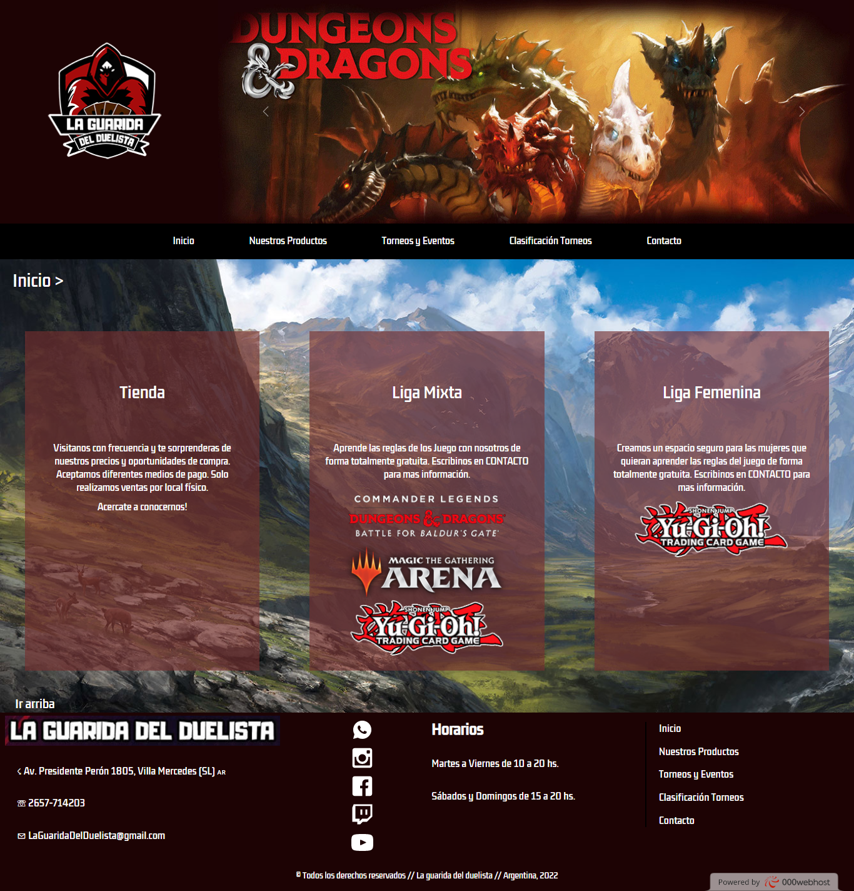
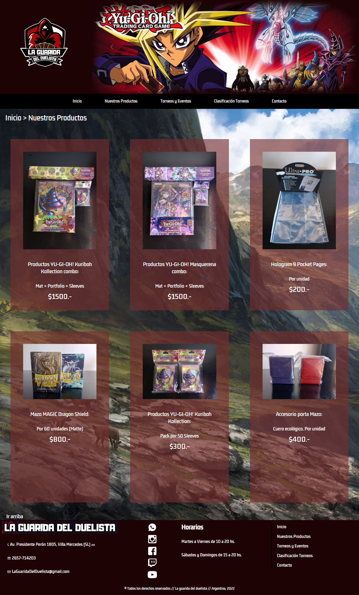
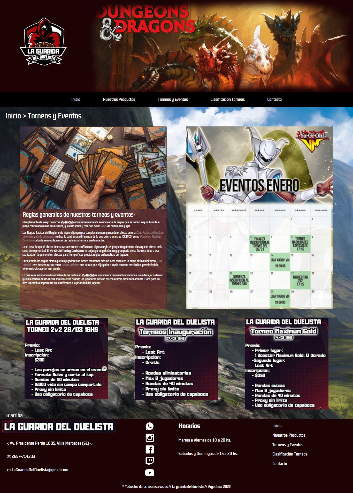
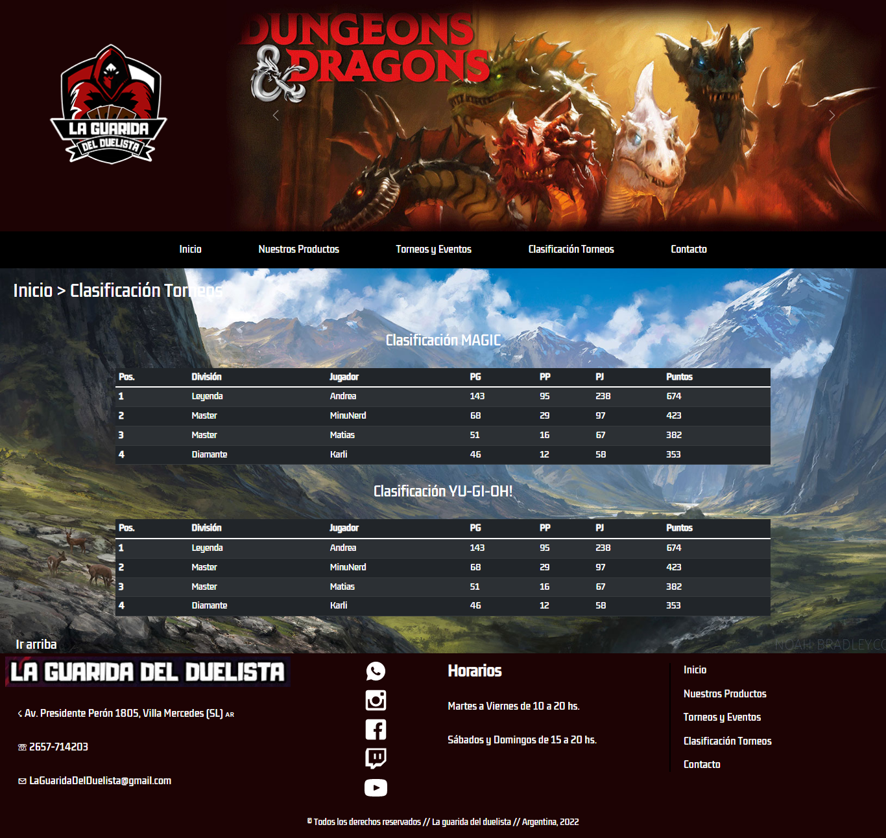
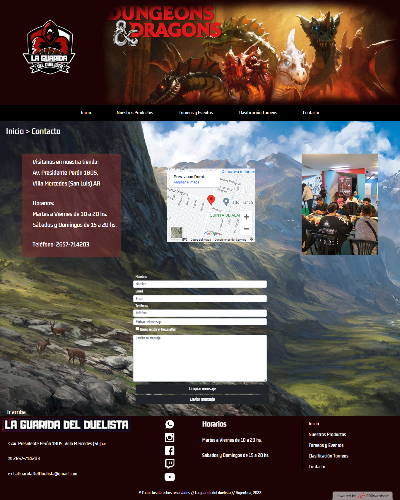

#La Guarida Del Duelista

###Web de torneos y tienda de productos oficiales MAGIC y Yu-Gi-Oh!
 
 

##INFORMACIÓN GENERAL
> En esta web encontraras todos los productos relacionados con MAGIC, Yu-Gi-Oh! y más. También podrás inscribirte a torneos y competencias nacionales, o sumarte a las tardes de juegos de mesa en el local.
 

> Mediante el formulario en la view "Contacto" se genera el vínculo con el futuro cliente.
 

> El sitios es completamente responsive para formato desktop, tablet y mobile.
 
 

##VIEWS
###Inicio:
Breve muestra de las cualidades con que cuenta la tienda.

 

###Nuestros Productos:
Disposición de fotos, detalles y precio de los productos de la tienda.

 

###Torneos y Eventos:
Calendario de torneos y promoción con detalle de próximos eventos.

 

###Clasificación Torneos:
Tabla de posiciones de jugadores en relación a tipo de torneo.

 

###Contacto:
Detalles de ubicación y formulario de contacto.

 
 

##TECNOLOGÍAS
<ul>
    <li>HTML</li>
    <li>CSS</li>
    <li>SASS</li>
    <li>FRAMEWORK: BOOTSTRAP</li>
    <li>LIBRERÍA ANIMACIONES: AOS</li>
</ul>
 

##AUTOR
**Sabrina Nair Cavallo**
