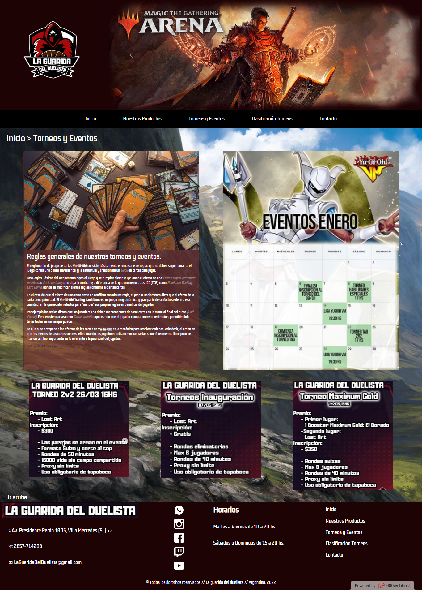

<h1>La Guarida Del Duelista</h1>

<h2>Web de torneos y tienda de productos oficiales MAGIC y Yu-Gi-Oh!</h2>

<h3>INFORMACIÓN GENERAL</h3>

En esta web encontraras todos los productos relacionados con MAGIC, Yu-Gi-Oh! y más. También podrás inscribirte a torneos y competencias nacionales, o sumarte a las tardes de juegos de mesa en el local.

Mediante el formulario en la view "Contacto" se genera el vínculo con el futuro cliente.

El sitios es completamente responsive para formato desktop, tablet y mobile.

<h3>VIEWS</h3>
<h4>Inicio:</h4>

Breve muestra de las cualidades con que cuenta la tienda.

<h4>Nuestros Productos:</h4>

Disposición de fotos, detalles y precio de los productos de la tienda.

<h4>Torneos y Eventos:</h4>

Calendario de torneos y promoción con detalle de próximos eventos.

<h4>Clasificación Torneos:</h4>

Tabla de posiciones de jugadores en relación a tipo de torneo.

<h4>Contacto:</h4>

Detalles de ubicación y formulario de contacto.

<h3>TECNOLOGÍAS</h3>
<ul>
    <li>HTML</li>
    <li>CSS</li>
    <li>SASS</li>
    <li>FRAMEWORK: BOOTSTRAP</li>
    <li>LIBRERÍA ANIMACIONES: AOS</li>
</ul>

<h3>AUTOR</h3>

Sabrina Nair Cavallo

